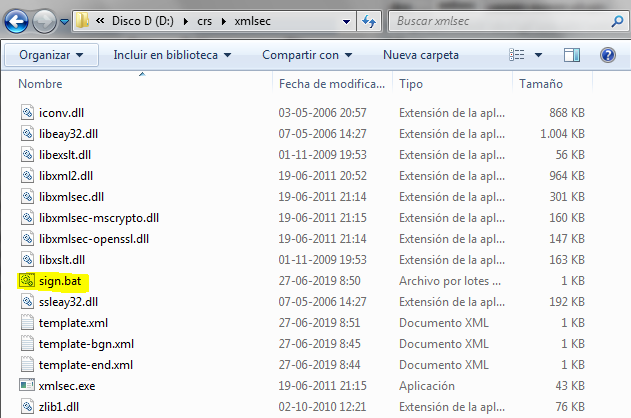

# crs-utils
## Utilidades para CRS SII

Para ejecutar estas utilidades se requiere:
- Tener instalado [Java](http://www.oracle.com/technetwork/java/index.html) versión 8 o mayor

### Firma XML (Java)
Para poder firmar un archivo CRS se requiere:
- El RUT del dueño de certificado sin puntos ni dígito verificador, por ejemplo, el RUT 11.111.111-1 sería 11111111
- El certificado digital en formato p12 (extensión .pfx o .p12), por ejemplo, [ks.p12](./ks.p12)
- La clave del almacén p12, por ejemplo, 11111111, si no la conoce se coloca la misma de la clave privada
- La clave de la llave privada, por ejemplo, 11111111
- El archivo XML CRS, por ejemplo, [crs.xml](./crs.xml)
- Descargar la utilidad [crs-utils-1.0.1.jar](./crs-utils-1.0.1.jar)

En el archivo [sign.bat](./sign.bat) se puede ver como llamar a la utilidad para firmar un archivo:
```bash
java -jar -Dfile.encoding=UTF-8 crs-utils-1.0.1.jar^
 -rut 11111111^
 -ks ks.p12^
 -kspass 11111111^
 -kpass 11111111^
 -file crs.xml
 ```
Al ejecutarlo se debería ver:
```bash
OK:
        Archivo [crs-utils\crs.xml]
        Firmado en archivo [crs-utils\crs-signed.xml]
        Para RUT [11111111]
```
Y se debería generar como resultado un archivo crs firmado [crs-signed.xml](./crs-signed.xml)

#### Código
El código incluido en el archivo [crs-utils-1.0.1.jar](./crs-utils-1.0.1.jar) está basado en lo publicado por [IRS](http://irsgov.github.io) para FATCA
http://irsgov.github.io/IDES-Data-Preparation-Java/

### Firma XML (XMLSec)
Como alternativa si se tiene problemas con la firma, se puede utilizar la utilidad **[xmlsec](https://www.aleksey.com/xmlsec/index.html)**, para lo cual se deben seguir los siguientes pasos:

**1)** Descargar el archivo **[xmlsec](./xmlsec.zip)**

**2)** Extraer el zip, por ejemplo, en **d:\crs**



**3)** Firmar y Verificar el documento

```bash
sign.bat --pkcs12 ks.p12 --pwd 11111111 crs.xml
```

Donde de debe reemplazar --pkcs12 **ks.p12** y --pwd **11111111** por el archivo p12 y clave que correspondan

### Envio XML
Para enviar un archivo CRS a ambiente de pruebas utilizando la línea de comandos se requiere descargar el archivo [sara-client-1.0.0.jar](./sara-client-1.0.0.jar)

Y ejecutar lo siguiente:
```bash
java -cp .;sara-client-1.0.0.jar -Dfile.encoding=UTF-8 cl.sii.sara.client.SaraCrsTestClientLauncher
 ```

Se siolicitarán ciertos argumentos y se preguntará si quiere enviar el reporte:

```bash
java -cp .;sara-client-1.0.0.jar -Dfile.encoding=UTF-8 cl.sii.sara.client.SaraCrsTestClientLauncher
Ingrese Sender:
MiInstitucionFinancieraTest
Ingrese Data File:
crs-signed.xml
Ingrese Key Store File:
ks.p12
Ingrese Private Key Password:
****

INFO cl.sii.sara.client.SaraCrsTestClientCmd - Parametros:
-"s" (Sender) MiInstitucionFinancieraTest
-"df" (Data File) crs-signed.xml
-"ksf" (Key Store File) ks.p12
-"pkp" (Private Key Password) ****
-"cto" (HTTP Connection Timeout) 300000
-"rto" (HTTP Read Timeout) 300000
-"surl" (WS Seed URL) https://ws1.sii.cl/WSAUT/services/CrSeed
-"turl" (WS Token URL) https://ws1.sii.cl/WSAUT/services/GetTokenFromSeed
-"wsurl" (WS Sara) https://ws1.sii.cl/WSSARADATACERT/receiverService
-"r" (Receiver) SII_CRS
-"t" (Payload Type) CRS_DOM
-"v" (Version) 1.0
-"p" (Period) 2018
-"pt" (Parts) 1
-"pi" (Part Index) 1
-"dt" (Data Type) XML
-"dc" (Data Charset) UTF-8
-"dn" (Data Not Included) false
-"op" (Operation) su

Desea enviar reporte CRS con los parámetros? (S/N):
s
INFO cl.sii.sara.client.SaraClientCmd - Archivo configuracion log [jar:file:/sara-client-1.0.0.jar!/simplelogger.properties]
INFO cl.sii.sara.client.SaraClientCmd - Parametros:
-"s" (Sender) MiInstitucionFinancieraTest
-"df" (Data File) crs-signed.xml
-"ksf" (Key Store File) crs-signed.xml
-"pkp" (Private Key Password) ****
-"cto" (HTTP Connection Timeout) 300000
-"rto" (HTTP Read Timeout) 300000
-"surl" (WS Seed URL) https://ws1.sii.cl/WSAUT/services/CrSeed
-"turl" (WS Token URL) https://ws1.sii.cl/WSAUT/services/GetTokenFromSeed
-"wsurl" (WS Sara) https://ws1.sii.cl/WSSARADATACERT/receiverService
-"r" (Receiver) SII_CRS
-"t" (Payload Type) CRS_DOM
-"v" (Version) 1.0
-"p" (Period) 2018
-"pt" (Parts) 1
-"pi" (Part Index) 1
-"dt" (Data Type) XML
-"dc" (Data Charset) UTF-8
-"dn" (Data Not Included) false
-"op" (Operation) su

INFO cl.sii.sara.client.SaraClientCmd - Obteniendo semilla url [https://ws1.sii.cl/WSAUT/services/CrSeed], CTimeout [300000], RTimeout [300000] y Compression [false]
INFO cl.sii.sara.client.SaraClientCmd - Obteniendo token [https://ws1.sii.cl/WSAUT/services/GetTokenFromSeed], CTimeout [300000], RTimeout [300000] y Compression [false]
INFO cl.sii.sara.client.SaraClientCmd - Haciendo submit url [https://ws1.sii.cl/WSSARADATACERT/receiverService], CTimeout [300000], RTimeout [300000]
INFO cl.sii.sara.client.SaraClientCmd - Manifest:
<?xml version="1.0" encoding="UTF-8" standalone="yes"?>
<sara:Manifest xmlns:sara="http://sara.sii.cl/api">
    <sara:Sender>MiInstitucionFinancieraTest</sara:Sender>
    <sara:Receiver>SII_CRS</sara:Receiver>
    <sara:PayloadType>CRS_DOM</sara:PayloadType>
    <sara:Version>1.0</sara:Version>
    <sara:Period>2018</sara:Period>
    <sara:Timestamp>2019-06-05T13:49:38.919-0400</sara:Timestamp>
    <sara:Parts>1</sara:Parts>
    <sara:PartIndex>1</sara:PartIndex>
    <sara:DataType>XML</sara:DataType>
    <sara:DataCharset>UTF-8</sara:DataCharset>
    <sara:DataNil>false</sara:DataNil>
</sara:Manifest>

INFO cl.sii.sara.client.SaraClientCmd - SubmitResponse:
<?xml version="1.0" encoding="UTF-8" standalone="yes"?>
<sara:SubmitResponse xmlns:sara="http://sara.sii.cl/api">
    <sara:ReceptionStatus>
        <sara:Id>RID000000000000000000001</sara:Id>
        <sara:Timestamp>2019-06-05T13:49:40.804-0400</sara:Timestamp>
        <sara:Status>RECEIVED</sara:Status>
        <sara:Manifest>
            <sara:Sender>MiInstitucionFinancieraTest</sara:Sender>
            <sara:Receiver>SII_CRS</sara:Receiver>
            <sara:PayloadType>CRS_DOM</sara:PayloadType>
            <sara:Version>1.0</sara:Version>
            <sara:Period>2018</sara:Period>
            <sara:Timestamp>2019-06-05T13:49:38.919-0400</sara:Timestamp>
            <sara:Parts>1</sara:Parts>
            <sara:PartIndex>1</sara:PartIndex>
            <sara:DataType>XML</sara:DataType>
            <sara:DataCharset>UTF-8</sara:DataCharset>
            <sara:DataNil>false</sara:DataNil>
        </sara:Manifest>
    </sara:ReceptionStatus>
</sara:SubmitResponse>

INFO cl.sii.sara.client.SaraClientCmd - ID: RID000000000000000000001
INFO cl.sii.sara.client.SaraClientCmd - Status: RECEIVED
```
